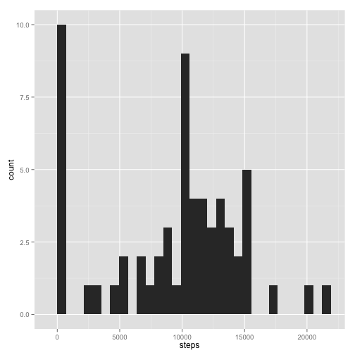
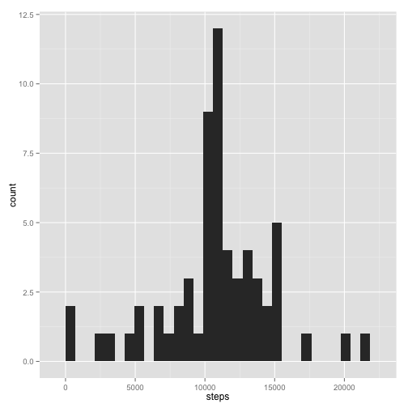
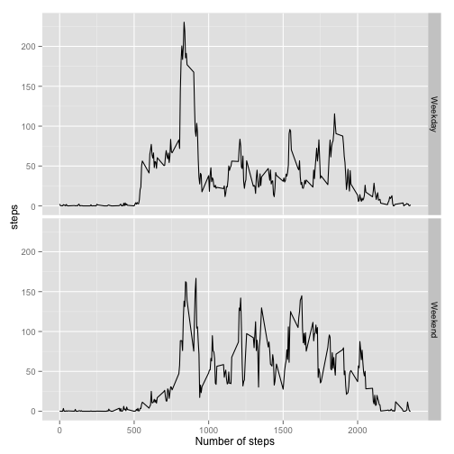

# Reproducible Research: Peer Assessment 1


## Loading and preprocessing the data

```r
library(dplyr)
```

```
## 
## Attaching package: 'dplyr'
## 
## The following objects are masked from 'package:stats':
## 
##     filter, lag
## 
## The following objects are masked from 'package:base':
## 
##     intersect, setdiff, setequal, union
```

```r
library(ggplot2)

file <- "pa1_activity.zip"
# download.file('https://d396qusza40orc.cloudfront.net/repdata%2Fdata%2Factivity.zip',
# method='curl', destfile=file) unzip(file)

activity <- read.csv("activity.csv")
```


## What is mean total number of steps taken per day?

```r
dailySteps <- group_by(activity, date) %.% summarise(steps = sum(steps, na.rm = T))
ggplot(dailySteps, aes(steps)) + geom_histogram()
```

```
## stat_bin: binwidth defaulted to range/30. Use 'binwidth = x' to adjust this.
```

 

```r
mean(dailySteps$steps)
```

```
## [1] 9354
```


Mean daily steps = 9354.2295

## What is the average daily activity pattern?

```r
intervalSteps <- group_by(activity, interval) %.% summarise(steps = mean(steps, 
    na.rm = T))
intervalSteps
```

```
## Source: local data frame [288 x 2]
## 
##    interval   steps
## 1         0 1.71698
## 2         5 0.33962
## 3        10 0.13208
## 4        15 0.15094
## 5        20 0.07547
## 6        25 2.09434
## 7        30 0.52830
## 8        35 0.86792
## 9        40 0.00000
## 10       45 1.47170
## ..      ...     ...
```

```r
ggplot(intervalSteps, aes(x = interval, y = steps)) + geom_line()
```

 

```r
mostActiveInterval <- intervalSteps[which.max(intervalSteps$steps), "interval"]
mostActiveInterval
```

```
## [1] 835
```


## Imputing missing values
I am using the mean number of steps during a particular time interval over all the days in the place of the missing value.


```r
numMissing <- sum(is.na(activity$steps))
numMissing
```

```
## [1] 2304
```

```r

missingInds <- which(is.na(activity$steps))
intervalMissing <- data.frame(interval = activity[missingInds, "interval"])
activityNew <- activity
activityNew[missingInds, "steps"] <- (left_join(intervalMissing, intervalSteps, 
    by = "interval"))$steps

dailyStepsNew <- group_by(activityNew, date) %.% summarise(steps = sum(steps, 
    na.rm = T))
ggplot(dailyStepsNew, aes(steps)) + geom_histogram()
```

```
## stat_bin: binwidth defaulted to range/30. Use 'binwidth = x' to adjust this.
```

 

```r
mean(dailyStepsNew$steps)
```

```
## [1] 10766
```

```r
median(dailyStepsNew$steps)
```

```
## [1] 10766
```


The mean number of daily steps after imputing missing values is 1.0766 &times; 10<sup>4</sup>. This is greater than before.

## Are there differences in activity patterns between weekdays and weekends?

```r
weekday <- weekdays(as.POSIXct(activityNew$date))
activityNew$dayType <- rep("Weekday", nrow(activityNew))
activityNew$dayType[which(weekday %in% c("Sunday", "Saturday"))] <- "Weekend"
activityNew$dayType <- as.factor(activityNew$dayType)

tmp <- group_by(activityNew, interval, dayType)
intervalStepsNew <- group_by(activityNew, interval, dayType) %.% summarise(steps = mean(steps, 
    na.rm = T))

ggplot(intervalStepsNew, aes(interval, steps)) + geom_line() + facet_grid(dayType ~ 
    .) + xlab("Number of steps")
```

 


As seen from the above charts, overall activity is higher on weekends, but the highest peak is in the morning on weekdays. On weekends, the activity is relatively more uniform throughout the day.
